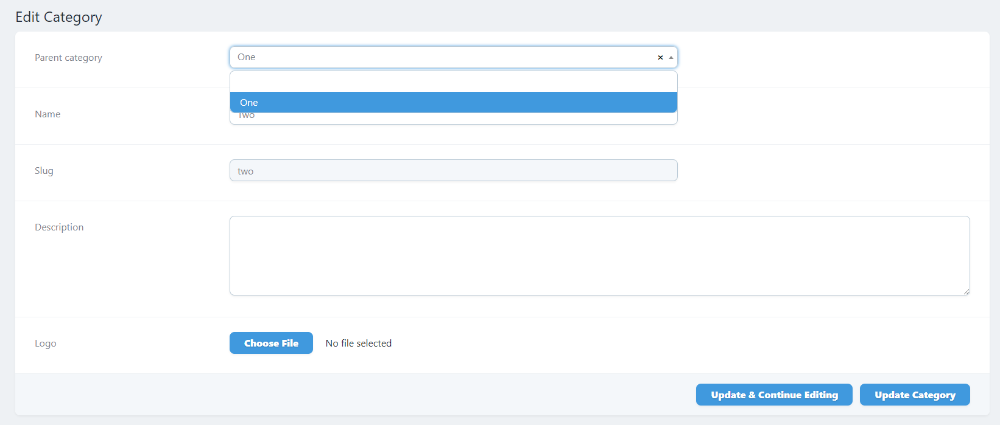
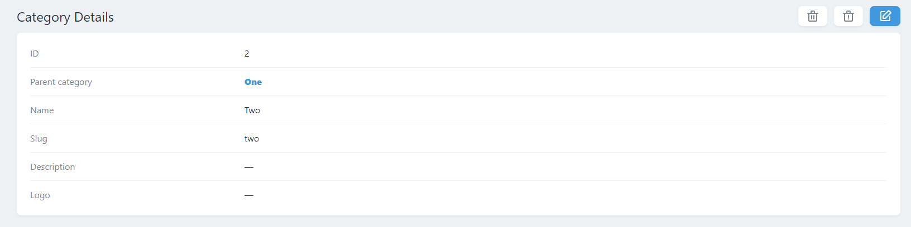
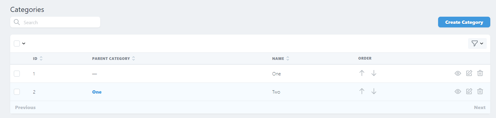

[](https://github.com/koss-shtukert/laravel-nova-select2-auto-complete/stargazers)
[](https://github.com/koss-shtukert/laravel-nova-select2-auto-complete/network)
[](https://github.com/koss-shtukert/laravel-nova-select2-auto-complete/issues)
[](https://github.com/koss-shtukert/laravel-nova-select2-auto-complete/commits)

# Laravel Nova Select2 Auto-Complete

##### An auto-completing Laravel Nova search field.

Provides a capability of auto-completed searching for results inside a select input field.

Based on [SELECT2](https://select2.org) (The jQuery replacement for select boxes)







## Installation

You can install the package in to a Laravel app that uses [Nova](https://nova.laravel.com) via composer:

```bash
composer require koss-shtukert/laravel-nova-select2-auto-complete
```

## Documentation

Please visit on [Wiki page](https://github.com/koss-shtukert/laravel-nova-select2-auto-complete/wiki) 
